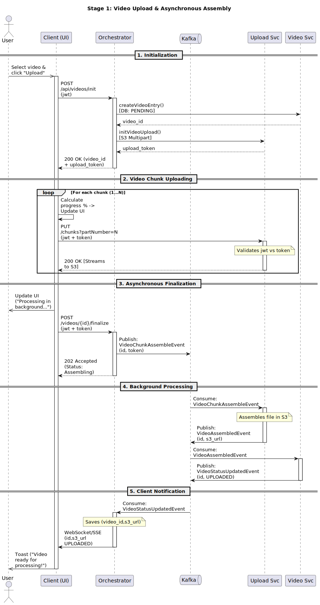
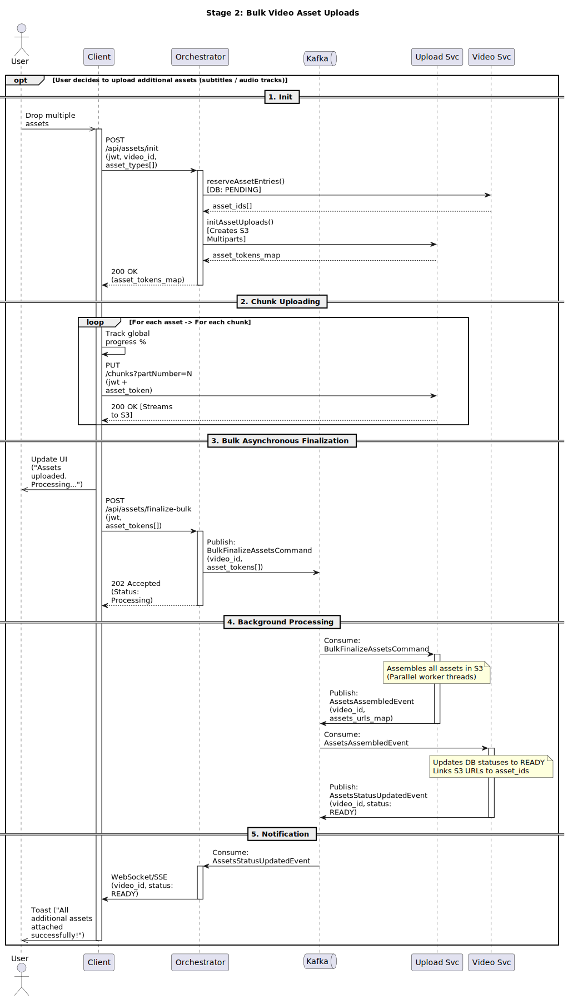
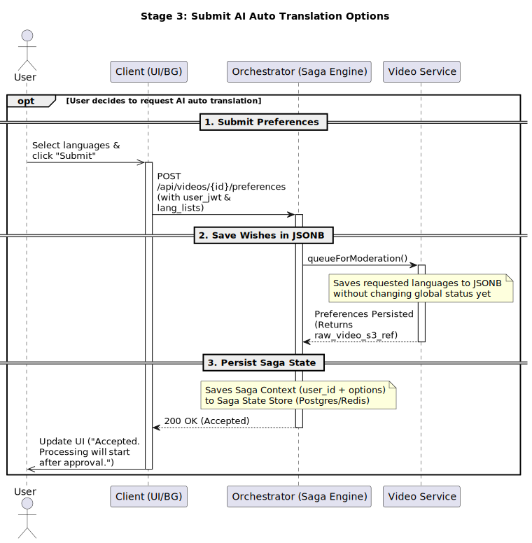
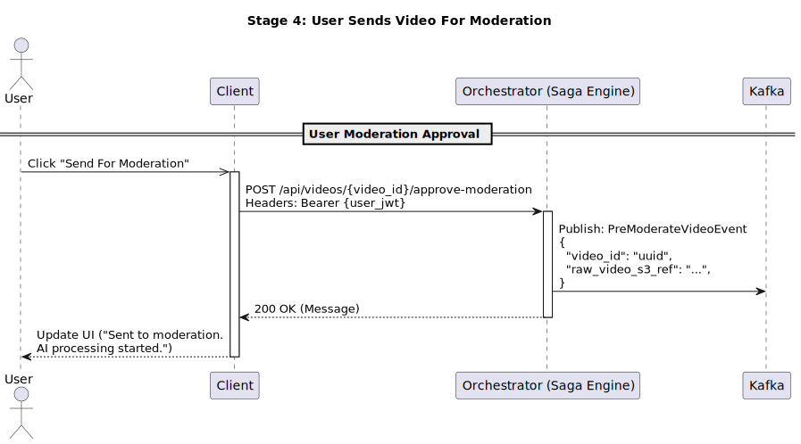
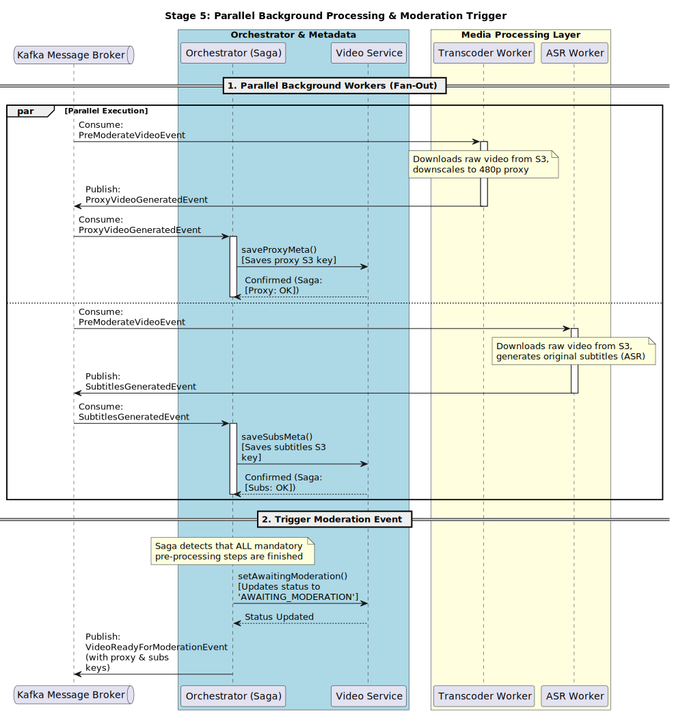
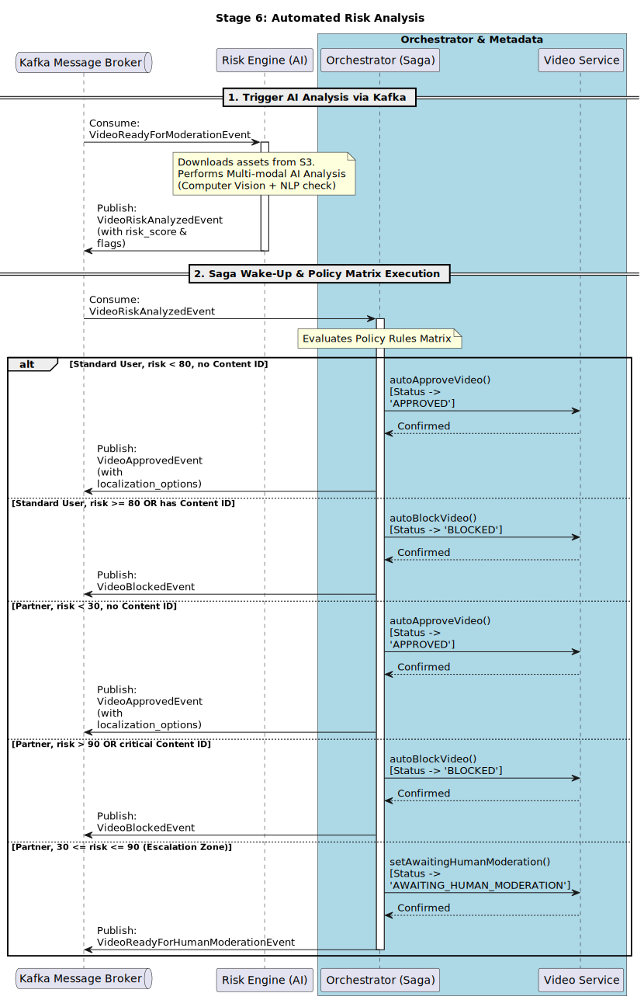
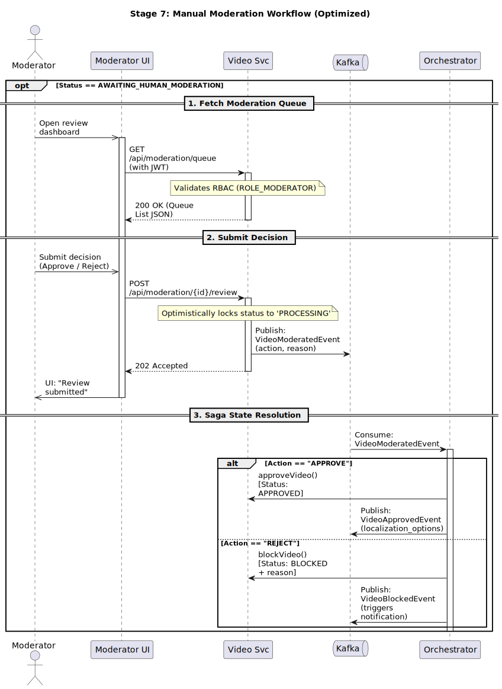
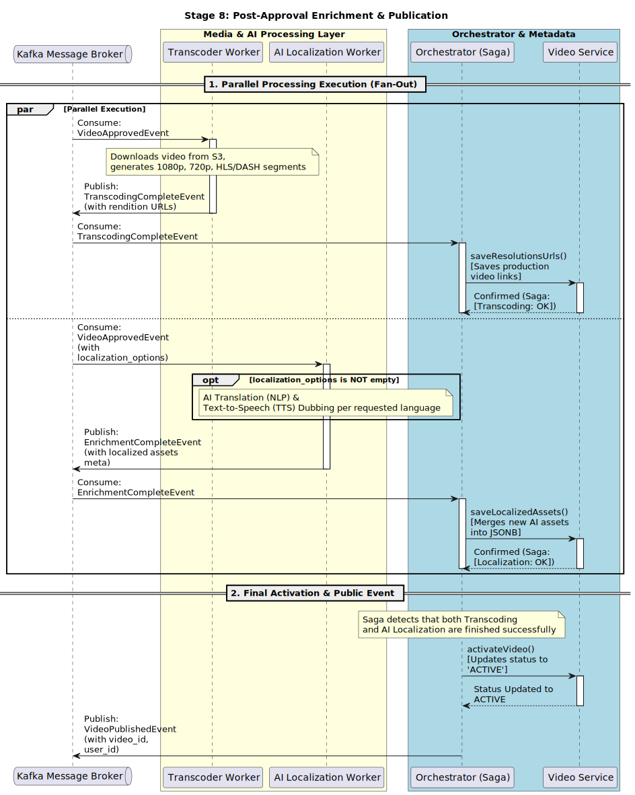
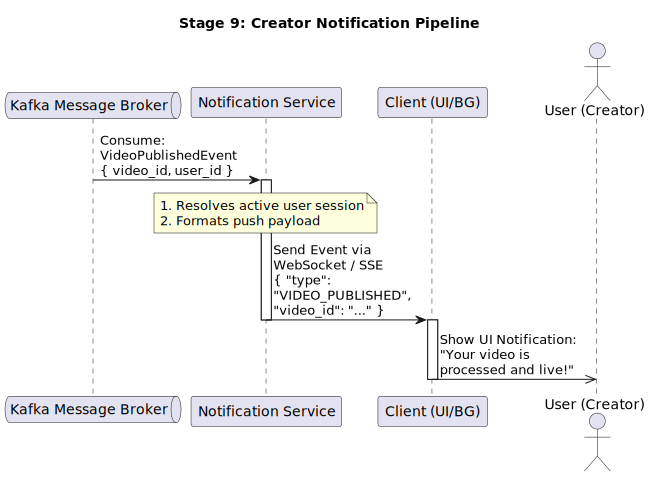

# End-to-End Event-Driven Video Processing Pipeline

An end-to-end, event-driven pipeline that automates the entire video processing lifecycle from initial upload to final publication.

> **Note on diagrams:** In the sequence diagrams, infrastructure components (**Postgres DB, Redis Saga Store, S3 Storage**) are intentionally **hidden to improve readability** of the service-to-service architecture layer.  

## Stage 1: Secure Multipart Video Upload & Assembly

**Quick Summary**  
Handles secure, reliable chunked uploads for large video files using a zero‑trust proxy and Saga Orchestration to guarantee strict multi‑tenancy isolation.

**Technical Highlights**

- **Zero‑Trust Storage Ingestion:** The Upload Service generates an encrypted `upload_token` containing hidden S3 metadata (`UploadId`, `Key`) so the client never interacts with or knows cloud credentials.
- **Token Theft Protection:** Each chunk upload (`PUT /chunks`) explicitly validates that the `token_user_id` inside the decrypted token matches the active `current_user_id` from the Session JWT.
- **Multi‑Tenancy Guard:** The final database state transition to `UPLOADED` applies a strict `WHERE id = video_id AND user_id = user_id` constraint to prevent unauthorized cross‑tenant mutations.

**Sequence Diagram**  

---

## Stage 2: Bulk Video Asset Uploads

**Quick Summary**  
An optional multi‑file ingestion pipeline that allows users to upload multiple localized tracks (subtitles/audio) in bulk, isolated from the core video flow.

**Technical Highlights**

- **Atomic Document Reservation:** The Orchestrator reserves tracking space by injecting a batch of pending `asset_ids` directly into a Postgres `JSONB` column via a single atomic write.
- **Granular Session Isolation:** Each asset track uploads via its own independent cryptographic token, ensuring a network failure in one subtitle file never corrupts parallel audio tracks.
- **Partial Document Evolution:** During finalization, the system uses native database `jsonb_set` operations to dynamically flip individual asset statuses to `READY` without locking or modifying the main video row.

**Sequence Diagram**  

---

## Stage 3: Submit AI Auto Translation Options

**Quick Summary**  
An optional workflow where the user selects desired languages for automated AI translation and dubbing, persisting their preferences as a metadata wishlist for downstream processing.

**Technical Highlights**

- **Non‑Blocking Ingestion:** The user’s request is processed statelessly; the requested languages are injected into a database `JSONB` document without triggering immediate global status mutations or locking rows.
- **Saga Context Preservation:** The Orchestrator intercepts the payload and caches the translation parameters (subtitles/audio target maps) in a centralized Saga State Store (Postgres/Redis). This guarantees state durability across asynchronous processing gaps.
- **Context Preservation for Workers:** On successful persistence, the pipeline extracts and returns core storage metadata (`raw_video_s3_ref`), providing necessary context for the asynchronous workers in the next stage.

**Sequence Diagram**  

---

## Stage 4: User Sends Video For Moderation

**Quick Summary**  
Triggers the official start of the processing lifecycle by broadcasting a secure event to Kafka, moving the video from a draft state into active background processing.

**Technical Highlights**

- **Event‑Driven Fan‑Out Initiation:** The Orchestrator intercepts the user's manual trigger and instantly publishes a `VideoUploadedEvent` to Kafka, safely offloading heavy media processing tasks to isolated background workers.
- **Stateless Gateway Processing:** The HTTP request‑response cycle finishes within milliseconds, immediately unblocking the client app while the backend shifts to an asynchronous, decoupled architecture.
- **Saga Context Propagation:** The emitted event wraps crucial multi‑tenant identifiers (`video_id`, `raw_video_s3_ref`), ensuring that downstream consumer nodes can process the media stream without querying the primary database for context.

**Sequence Diagram**  

---

## Stage 5: Parallel Background Processing & Moderation Trigger

**Quick Summary**  
Executes heavy pre‑processing tasks (video proxy generation and speech‑to‑text) concurrently via Kafka workers, using the Saga Orchestrator as a synchronization barrier (Join Node).

**Technical Highlights**

- **Asynchronous Fan‑Out:** The ingest payload triggers multiple independent consumer threads simultaneously via Kafka, completely decoupling compute‑intensive video encoding from text‑based ASR (Automated Speech Recognition).
- **Saga Barrier Sync (Join Node):** The Orchestrator acts as a stateful aggregator, tracking internal bitflags (`[Proxy: OK]`, `[Subs: OK]`). It guarantees that downstream automated moderation never starts until all mandatory assets are compiled.
- **Contextual Event Enrichment:** Once conditions are satisfied, the system atomically changes the state to `AWAITING_MODERATION` and broadcasts a highly enriched event packed with newly generated resource keys, feeding the downstream AI validation model.

**Sequence Diagram**  

---

## Stage 6: Automated Risk Analysis

**Quick Summary**  
Leverages a multi‑modal AI Risk Engine to score content safety and executes a dynamic server‑side Policy Rules Matrix to automatically approve, block, or escalate videos for manual review.

**Technical Highlights**

- **Multi‑Modal AI Ingestion:** The AI Risk Engine processes text (NLP subtitles check) and video (Computer Vision) concurrently, returning an aggregated `risk_score` and Copyright flags to Kafka.
- **Dynamic Policy Rules Matrix:** The Orchestrator evaluates a business matrix combining User Tiers (Standard vs Partner), algorithmic thresholds, and Content ID hits, avoiding hardcoded branching inside services.
- **Intelligent Escalation Routing:** Implements an automated escalation threshold (30–90 risk for Partners) that routes ambiguous assets to human queues while instantly fast‑tracking clear approvals or violations.
- **Context Preservation:** Successful paths submerge the user's initial choices (`localization_options`) directly into the `VideoApprovedEvent`, keeping downstream workers independent of central state reads.

**Sequence Diagram**  

---

## Stage 7: Manual Moderation Workflow

**Quick Summary**  
Provides a human‑in‑the‑loop fallback mechanism for high‑risk assets, allowing authorized moderators to resolve state escalations via an event‑driven review pipeline.

**Technical Highlights**

- **RBAC‑Protected Read Layer:** The Video Service enforces strict Role‑Based Access Control (checking for `ROLE_MODERATOR` inside the incoming JWT) before exposing the pending moderation queue.
- **Optimistic Task Locking:** Submitting a review immediately flips the status to `PROCESSING` within the domain. This acts as a lightweight concurrency lock, preventing duplicate reviews or race conditions from multiple moderators.
- **Event‑Driven Write Offloading:** Instead of processing decisions synchronously, the UI receives an immediate `202 Accepted` response. The decision is decoupled and dispatched as a `VideoModeratedEvent` to Kafka.
- **Saga Reconciliation Branching:** The Orchestrator consumes the decision asynchronously and forks the state machine: successful overrides rejoin the standard AI generation stream (`VideoApprovedEvent`), while violations invoke final rejection logic.

**Sequence Diagram**  

---

## Stage 8: Post‑Approval Enrichment & Publication

**Quick Summary**  
Executes heavy production rendering and multi‑language AI localization (subtitles/TTS dubbing) concurrently, utilizing the Saga Orchestrator to synchronize final publication.

**Technical Highlights**

- **Compute‑Heavy Resource Isolation:** Isolates production transcoding pipelines (generating 1080p/720p HLS/DASH segments) into dedicated worker nodes via Kafka, preventing resource starvation across core metadata services.
- **On‑Demand AI Localization Trigger:** The AI Localization Worker conditionalizes its operations via an internal check; it spins up advanced NLP translation and Text‑to‑Speech (TTS) voice dubbing engines only if `localization_options` are present.
- **Asynchronous State Aggregation (Join Node):** The Orchestrator manages asynchronous convergence, ensuring the video remains un‑discoverable until both `TranscodingCompleteEvent` and `EnrichmentCompleteEvent` flags return successfully.
- **Atomic State Activation:** Transitions the final lifecycle state to `ACTIVE` across the platform and broadcasts a high‑level `VideoPublishedEvent` to downstream read‑models and client notification pipelines.

**Sequence Diagram**  

---

## Stage 9: Decoupled Creator Notification Pipeline

**Quick Summary**  
Instantly broadcasts real‑time publication alerts to the creator's UI using a fully decoupled, event‑driven notification service over persistent streaming protocols.

**Technical Highlights**

- **Decoupled Architecture Boundary:** The Notification Service is completely isolated from heavy computing services; it activates strictly by consuming a stateless `VideoPublishedEvent` from Kafka.
- **Persistent Connection Routing:** Avoids inefficient HTTP polling by mapping the target `user_id` to active, stateful web‑sockets or Server‑Sent Events (SSE) connections managed in memory.
- **Asynchronous Client Delivery:** The frontend browser/client runtime acts as an asynchronous consumer, immediately resolving the payload to render non‑blocking UI notifications and system sounds while keeping the user experience completely smooth.

**Sequence Diagram**  

---

## Summary

This pipeline demonstrates a robust, scalable, and secure video processing architecture. Each stage is decoupled, event‑driven, and designed with clear separation of concerns, multi‑tenancy, and fault tolerance in mind. The use of Saga Orchestration, Kafka, and stateless services ensures reliability and maintainability across the entire lifecycle.
